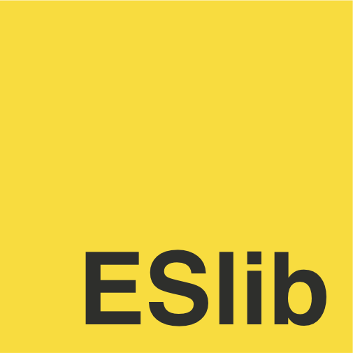

[![Build Status][build]](https://circleci.com/gh/bcherny/eslib) [![npm]](https://www.npmjs.com/package/eslib) [![mit]](https://opensource.org/licenses/MIT)

[build]: https://img.shields.io/circleci/project/bcherny/eslib.svg?branch=master&style=flat-square
[npm]: https://img.shields.io/npm/v/eslib.svg?style=flat-square
[mit]: https://img.shields.io/npm/l/eslib.svg?style=flat-square

> Safe, extended standard library for TypeScript and JavaScript

**Work in progress.**

## Example

```ts
import 'eslib'

[1, 2, 3, 4]
  .chunk(2)
  .map(arr => arr.head()) // [1, 3]
```

## "This is blasphemy!"

Yes yes, extending the `prototype` is usually bad. But *why* is it bad? Well, there are 2 reasons:

1. Libraries might extend the `prototype` in unexpected ways
2. Those extensions might conflict with one another

The thing is, static type systems fix these problems. If you're using TypeScript, you'll know exactly how the prototype has been extended (you'll even get autocomplete for it), and you'll know at compile time if there are any conflicting extensions. In fact languages like Scala embrace this pattern!

ESLib takes advantage of this to give JavaScript the standard library it deserves, guilt-free.

## Tests

```sh
npm test
```

## TODO

- Decide how to treat native methods (eg. `filter`) - overwrite them with the lodash versions? Leave them alone?

## License

MIT